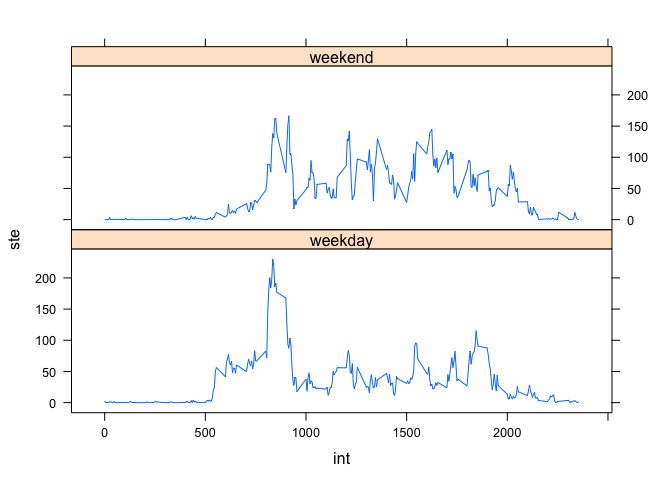

# Reproducible Research Course Project 1

### Loading and preprocessing the data

First of all, we have to load all required packages for the goals of the analysis of next sections. Here is the code that loads lubridate that allows us the usage of some very useful functions for handle with data and times. We also load lubridate packages that will be used for the last graph of this study.


```r
library(lubridate)
library(lattice)
```

The next step of our analysis is to load data with read.csv function. Of course the data set must be is our working directory, otherwise the following code will not work properly.


```r
data <- read.csv( "activity.csv",
                  header = TRUE,
                  stringsAsFactors = FALSE,
                  na.strings = "NA",
                  colClasses = c("numeric", "POSIXct", "numeric")
                  )
```

### What is mean total number of steps taken per day?

The next code use the tapply function to sum the steps for each day and store the result is a data.frame named mean_day. In order to achieve the right result, some modifications are required. The code uses the names of steps_day (which are dates) to create a new column for days and after that we use the ymd function of the lubridate package to convert column Day as POSIXct objects.


```r
data1 <- na.omit(data)
steps_day <- tapply(data1$steps, data1$date, sum)
mean_day <- data.frame(Steps = steps_day, Day = names(steps_day))
mean_day$Steps <- as.vector(mean_day$Steps)
rownames(mean_day) <- NULL
mean_day$Day <- ymd(mean_day$Day)
```

The next code plots an histogram of the (mean of) steps taken per each day.


```r
hist(mean_day$Steps,
     col= "#1E88E5",
     main = "Histogram of Steps",
     xlab = "Class of Steps",
     xaxt = "n"
     )
axis(2, labels = FALSE)
axis(1, at = c(0, 5000, 10000, 15000, 20000, 25000), labels =
         c(0, 5000, 10000, 15000, 20000, 25000) )
```

 

The following piece of code shows the mean and the median of steps taken each day. They are almost the same.


```r
memean <- summary(mean_day$Steps)
memean[3:4]
```

```
## Median   Mean 
##  10760  10770
```


### What is the average daily activity pattern?

The following code creates an object data frame named aver2 that contains the mean of steps for each interval. The code also provides a line plot of the values for each interval in order to have an idea of the steps taken for each interval.


```r
aver1 <- tapply(data1$steps, data1$interval, mean)
aver2 <- data.frame(Intervals = names(aver1), Mean = aver1 )
rownames(aver2) <- NULL
aver2$Mean <- as.numeric(aver2$Mean)
plot(aver2$Mean,
     col= "#1E88E5",
     type = "l",
     main = "Mean of each Interval",
     xlab = "Intervals",
     ylab = "Means")
```

 

It is useful to find out the interval with the highest number of steps. The following cose allows us to see that and print the result.


```r
MaxInt <- aver2[aver2$Mean == max(aver2$Mean) , ]
MaxInt
```

```
##     Intervals     Mean
## 104       835 206.1698
```


### Imputing missing values
To avoid bias in our analysis it is very useful to find out the number of missing values in our original dataset.


```r
sum(is.na(data))
```

```
## [1] 2304
```

As we can see in the previous piece of **R** code, the number of missing value is not so small. Such a large number might introduces bias and distortions in our analysis and so it is better to substitute every NA with a measure that is consistent is a certain way.

Next step is to look at which number of interval each NA belongs to and substitute it, the NA, with the average number of steps of that interval. In order to do some comparisons we create another data frame called dataNA and we perform the substitutions of NAs in this object.


```r
dataNA <- data
for(i in 1:nrow(data)){
    
    if(is.na(data[ i , 1]) == TRUE){
        subst <- aver2[aver2$Intervals == data[i, 3] , 2]
        dataNA[i,1] <- subst
    }
    else {}
    
}
```

As we can see, the previous code worked well and now we do not have NA anymore.


```r
if(sum(is.na(data)) == 0){print("There are no NAs!")}
```

Here we conduct the same analysis that drove us to the first histogram but this time using the dataNA data frame in order to see differences and an (eventual) impact of NAs.


```r
steps_day2 <- tapply(dataNA$steps, dataNA$date, sum)
mean_day2 <- data.frame(Steps = steps_day2, Day = names(steps_day2))
mean_day2$Steps <- as.vector(mean_day2$Steps)
rownames(mean_day2) <- NULL
mean_day2$Day <- ymd(mean_day2$Day)

hist(mean_day2$Steps,
     col= "#1E88E5",
     main = "Histogram of Steps",
     xlab = "Class of Steps",
     xaxt = "n"
)
```

 

And here is a comparion between the two means and medians (and other descriptive statistcs) of the two data frame.

```r
memean2 <- summary(mean_day2$Steps)
memt <- rbind(memean, memean2)
names <- c("Without NA", "NA filled")
row.names(memt) <- names
```

As we can see there are no significant differences between the two scenarios. One difference is in the frequency of the middle class of steps that is increased since we included other data filled with mean.


```r
WeekDays <- sapply(dataNA[, 2], weekdays)

dataNA <- cbind(dataNA, WeekDays)
```


### Are there differences in activity patterns between weekdays and weekends

Now it is useful to find out differences of behavior of the steps variable in different days. A logical question arises when we consider days in which subject (from who data are collected) works (weekdays) and days of the week end, in other words, when it is most likely that subject does not work.

The next code create an empty column in the dataNA data frame. This column will be very useful for our next analysis.


```r
dataNA[, "isWend"] <- NA
```

The next code is a loop that does (well) essentially one job: it checks all the elements of the WeekDays column of the dataNA data set that are "Saturday" or "Sunday" and mark them, in the isWend column as weekend of as a weekday is the conditions is FALSE. BY doing so we will end up with a column of all values that belong to weekday or to the weekend. This column will be vital in subsetting data and compare between work days and weekends.


```r
for(i in 1:nrow(dataNA)){
    if(dataNA$WeekDays[i] == "Saturday" | dataNA$WeekDays[i] == "Sunday") {
        dataNA$isWend[i] <- "weekend"
    }
    else{ dataNA$isWend[i] <- "weekday"}
}


dataNA$isWend <- as.factor(dataNA$isWend)
```

And now we compute the mean of the steps, of each interval by each group (weekend or weekday) with the aggregate function. The following code does that and plot two line graph to show differences.


```r
weekad <- aggregate(dataNA$steps ~ dataNA$interval + dataNA$isWend, dataNA, mean)
nam1 <- c("int", "w", "ste")
names(weekad) <- nam1
xyplot(ste ~ int | w, data = weekad, type = "l", layout = c(1,2))
```

 

As the graph shows it looks like this subject has a maximum amount of steps in the weekday but the medium level of all steps is higher for the weekend in fact we can see that the averages of steps for the weekend days are (in mean) higher.
